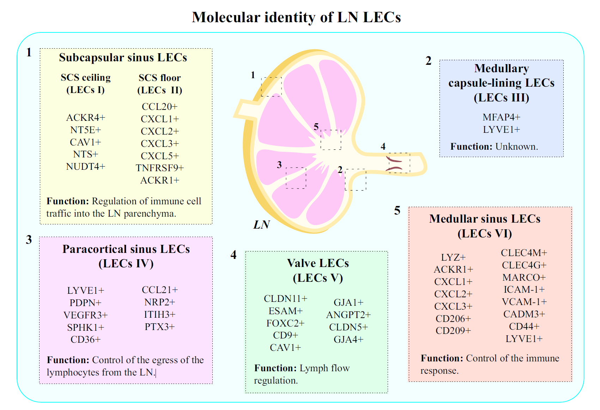

# immune cell markers
- T Cell: CD3D, CD3E, CD8A, CD4, CD2
    + CD4 T Cell: CD3D, CD3E, CD4
    + CD8 T Cell: CD3D, CD3E, CD8A

markers_tcell <- list(
    # T Cell
    # "T Cell" = c("CD3D", "CD3E"),

    # CD4
    # "CD4T" = c("CD4"), 
    "Th1" = c("CXCR3", "STAT1", "TBX21"), 
    "Th2" = c("PTGDR2", "GATA3", "BATF", "IRF4", "STAT6"), 
    # "Th17" = c("CCR6", "RORC"), 
    "Tfh" = c("CXCR5", "ICOS"), 
    "Treg" = c("IL2RA", "FOXP3", "LRRC32"), 
    
    # CD8
    # "CD8T" = c("CD8A", "CD8B"), 
    # "naive" = c("CD27", "SELL", "IL7R", "CCR7"), 
    "effector T" = c("IL2RB", "KLRG1", "IL2RA", "CD69"), 
    "effector memory T" = c("PTPRC", "KLRG1", "IL7R", "TNF", "IFNG"), 
    "central memory T" = c("SELL", "CCR7", "IL7R"), 

    # NK
    "NK" = c("NCAM1", "CD244", "GNLY", "GZMA", "GZMK"), 
    "ILC1" = c("NCAM1", "ITGAE", "CXCR3")
    # "ILC2" = c("KIT", "IL2RA", "GATA3", "GFI1"), 
    # "ILC3" = c("KIT", "IL7R", "IL7A", "IL17F", "IL22", "AHR", "TBX21", "TCF7"), 
    # "LTi" = c("KIT", "IL17", "IL22", "LTA", "AHR", "ID2", "CCR6", "CD7", "IL2RA"), 

    # "NKT" = c("TRAV24", "IL4", "IL10", "IL13", "IFNG", "TNF", "CD4", "CD8A", "ID2"), 
    # "gdT" = c("TRG", "TRD", "CD70", "CSF2", "CD5", "FCGR3A", "CD27")
)


- B Cell: CD79A, CD79B, MS4A1, BANK1, CD19, Ly6d, Igkc
    + Plasma Cell: IGHG1, MZB1, SDC1, CD79A

markers_bcell <- list(
    "memory" = c("TLR6", "TLR7", "TLR10", "CIR1", "PAX5"), 
    "plasma" = c("IGHG1", "MZB1", "SDC1", "CD79A"),
    "germinal center" = c("BCL6", "CD81", "IRF8", "PAX5"), 
    "marginal zone" = c("CR2", "SPIB", "CD81", "ITGAE"), 
    "follicular" = c("FCER2", "IGHD")
)


- NK Cell: NKG7, GZMA, NCAM1, GZMB, FGFBP2, FCG3RA
    + CD56bright NK: NCAM1(CD56), IL2RB, SELL
    + CD56dim NK: FCGR3A, KLRB1
    + resident NK: ITGA1, ITGAE, CXCR6
    + adaptive NK: KLRC2, FCER1G, ZBTB32


- Monocyte
    + human: CD14, FCGR3A
    + mouse: Csf1r, Ly86, Irf8


- Macrophage: C1QA, C1QB, C1QC, CX3CR1, ADGRE1, CD14, CD68, CD163, LYZ, FCGR3
```{r}
# from: 10.3390/ijms22136995
# human
markers_macrophage <- lits(
    "M0" = c("CSF1R", "CD14", "CD68", "ITGAM"), 
    "M1" = c("CD86", "MARCO", "CXCL9", "CXCL10", "CXCL11", "NOS2", "SOCS1", "FCGR1A"), 
    "M2" = c("TGM2", "FCER2", "ARG1", "CCL22", "CD163", "MRC1")
)

# mouse
markers_macrophage <- list(
    "M0" = c("Csf1r", "Adgre1", "Itgam"), 
    "M1" = c("Marco", "Cxcl9", "Cxcl10", "Cxcl11", "Nos2", "Socs1"), 
    "M2" = c("Mrc1", "Tgm2", "Retnla", "Chil3", "Arg1", "Ccl22", "Cd163")
)
```


- Dendritic Cell: LILRA4, PTCRA, ITGAX, CLEC9A
    + cDC: XCR1, FLT3, CCR7, CD1E
    + pDC: SIGLECH, CLEC10A, CLEC10A, CLEC12A, CLEC4C


- Platelet: PF4, TAGLN2


- Myeloid Cell: FCGR3A, CD14


- Granulate: "CCR3", "CD33", "IL5RA"
    + Neutrophil(中性粒细胞): CD14, ELANE, MME, MPO
    + Eosinophil(噬酸性粒细胞): CCR1, FCAR, IFNAR1, ITGA4, SIGLEC8
    + Basophil(噬碱性粒细胞): CD9, CD22, CD36, CD40LG, FCGR2B

- Mast cell: CST3, CPA3, KIT, TPSAB1, TPSB2, MS4A2, CMA1, CPE, CXCR4, IL10RA, PTGER2

- Red Blood Cell: 
    + mouse: Hba-a1, Hba-a2, Hbb-b1, Hbb-b2, Hbd, Hbg1, Hbg2, Hbe1
    + human: HBA1, HBA2, HBB, HBD, HBG1, HBG2, HBE1
        + 在婴儿阶段主要表达：HBG1, HBG2和HBE1


# endothelial cell markers
- Endothelial: PECAM1, CDH5, KDR, LY6C(Ly6c1), CLDN5, ABCB1, EBF1
    + venous: SELE, CSF3, IL6, G0S2, CLU, MMP1
    + atory: IGFBP3, CXCL12, FOS, CXCL3, HEY1, FN1, TCIM
    + capilary: RBP7, FABP4, ESM1, CD36, C11orf96
    + lyphatic: PROX1, PDPN, LYVE1, FTL4, CCL21, DSP, ITGA9, MRC1, DPP4
        - LEC I： ACKR4, NT5E, CAV1, NTS, NUDT4
        - LEC II： CCL20, CXCL1, CXCL2, CXCL3, CXCL5, TNFRSF9, ACKR1
        - LEC III: MFAP4, LYVE1
        - LEC IV: LYVE1, PDPN, VEGFR3, SPHK1, CD36, CCL21, NRP2, ITIH3, PTX3
        - LEC V: CLDN11, ESAM, FOXC2, CD9, CAV1, GJA1, ANGPT2, CLDN5, GJA4
        - LEC VI: LYZ, ACKR1, CXCL1, CXCL2, CXCL3, CD206, CD209, CLEC4M, CLEC4G, MARCO, ICAM1, VCAM1, CADM3, CD44, LYVE1

{width=100%}

# Epithelial cell markers
- Epithelial: EPCAM, KRT19, PROM1, CD24


# Stromal cell markers
- Fibroblast: FGF7, CNN1, COL1A1, COL3A1, VIM, LUM
- Vascular smooth muscle cell: DCN, ACTA2, TAGLN, TAGLN2, MYH11
- Pericyte: CSPG4, PDGFRB
- Adipocyte: Adipoq


# central neuron system markers
from GSE212199

- Astrocytes: AQP4, ADGRV1, GPC5, RYR3
- Microglia: C3, LRMDA, DOCK8
- OPC: TNR, IGSF21, NEU4, GPR17
- Ependymal: CFAP126, FAM183B, TEME212, PIFO, TEKT1, DNAH12
- Oligodendrocytes: MBP, PLP1, ST18
- Inhibitory: GAD1, LHFPL3, PCDH15
- Excitatory: CAMK2A, CBLN2, LDB2


# liver
- Hepatocyte: Alb, Afp, Anxa1, Anxa2


# heart
    "Atrial myocyte" = c("Nppa", "Gja5"), 
    "Ventricular myocyte" = c("Actn2", "Myh6", "Tnnt2"), 
    "Cardiomyocyte" = c("Acta1", "Actc1", "Tnnc1", "Tnnc3"), 
    "Cardiac Conduction system" = c("Cacna2d2", "Hcn4", "Tbx3", "Cacna1g", "Ephb3"), 
    "Endothelial" = c("Pecam1", "Tie1", "Flt1", "Fabp4", "Epas", "Egfl7"), 
    "Macrophage" = c("Cd68", "Cd74", "Lgals3", "Itgam"), 
    "Smooth muscule Cell" = c("Rgs5", "Tpm2"), 
    "Erythroid Cell" = c("Gata1", "Klf1", "Runx1", "Tal1", "Cldn6", "Cldn7", "Epcam"), 
    "Mesoderm derived Cell" = c("Cdh11", "Col3a1", "Pcolce"), 


# tumor
## MDSC
markers_myeloid <- list(
    "MDSC" = c("OLR1", "FATP2", "CD84", "SIGLEC5") # myeloid and MDSCmarkers discriminate from neutrophils
    "M-MDSC" = c("+" = "OLR1", "+" = "ITGAM", "+" = "CD14", "+" = "CD33", "-" = "HLA-DRA", "-" = "FUT4"), 
    # "PMN-MDSC" = c("+" = "FUT4", "+" = "CEACAM8", "+" = "ITGAM", "-" = "CD14"), 
    "G-MDSC" = c("+" = "ITGAM", "+" = "FUT4", "+" = "CEACAM8", "-" = "HLA-DRA", "-" = "CD14"), 
    "E-MDSC" = c("+" = "ANPEN", "+" = "CD33", "-" = "CD14", "-" = "FUT4", "-" = "HLA-DRA", "-" = "CD3"), 
    "Monocyte" = c("CD14", "CD33", "SIRPA", "IRF5", "STAT1"), 
    "M1" = c("IFNG", "IL1A", "IL1B", "FCGR3A", "FCGR2A"), 
    "M2" = c("IL10", "TGFB1", "IDO1", "CSF1R", "MSR1", "IRF4", "STAT6"), 
    "resident Mac" = c("AXL", "CCR2", "NOS2"), 
    "neutrophils" = c("S100A8", "S100A9", "LY6G", "CSF3R", "SLC25A37")
    # "cDC" = c("ITGAX", "CD40", "CD1B", "CD1C", "CCR7", "IDO1", "LAMP3"), 
    # "pDC" = c("IL3RA", "CLEC4C", "NRP1")
)

markers_myeloid <- list(
    "G-MDSC" = c("+" = "ITGAM", "-" = "CD14", "+" = "FUT4", "+" = "CEACAM8", "+" = "LOX1", "+" = "CD84"), 
    "M-MDSC" = c("+" = "CD14", "-" = "FUT4", "-" = "HLA-DRA"), 
    "E-MDSC" = c("+" = "ANPEN", "+" = "CD33", "-" = "CD14", "-" = "FUT4", "-" = "HLA-DRA", "-" = "CD3"), 
    "monocyte" = c("+" = "CD14", "-" = "FUT4", "-" = "HLA-DRA", "CD33", "SIRPA", "IRF5", "STAT1"), 
    "neutrophils" = c("+" = "ITGAM", "-" = "CD14", "+" = "FUT4", "+" = "CEACAM8", "S100A8", "S100A9", "LY6G", "CSF3R", "SLC25A37"), 
    "macrophage INHBA" = c("CCL4", "IL1RN", "INHBA"), 
    "Macrophage NLRP3" = c("NLRP3", "EREG", "IL1B"),
    "Macrophage LYVE1" = c("LYVE1", "PLTP", "SEPP1"),
    "Macrophage C1QC" = c("C1QC", "C1QA", "APOE")
)

## CAF
markers_fibroblast <- list(
    # "fibro" = c("COL1A1", "COL3A1"),
    # "myCAF" = c("ACTA2", "RGS5", "MYH11"), 
    "iCAF" = c("CCL2", "CXCL12", "CXCL14"), 
    "proCAF" = c("IGF1", "OGN", "C7"), 
    "matCAF" = c("COL10A1", "CTHRC1", "POSTN"), 
    "CAF" = c("ACTA2", "TAGLN", "CTHRC1"), 
    # "NF" = c("DCN", "IGFBP6", "MFAP5"), 
    "epiCAF" = c("EPCAM", "CD24"),
    "apCAF" = c("CD74", "HLA-DRA"), 
    # "meCAF" = c("PLA2G2A", "CRABP2"), 
    "pCAF" = c("BIRC5", "TOP2A"), 
    "TGFB-CAF" = c("TAGLN", "LRRC15"), 
    "IL1-CAF" = c("HAS1", "CCL2")
    # "positive marker" = c("PDPN", "COL1", "PDGFRA")
    # "negative markers" = c("PTPRC", "PECAM1", "EPCAM", "CSPG4", "RGS5", "PROM1", "CD24", "KDR", "CDH5")
)
